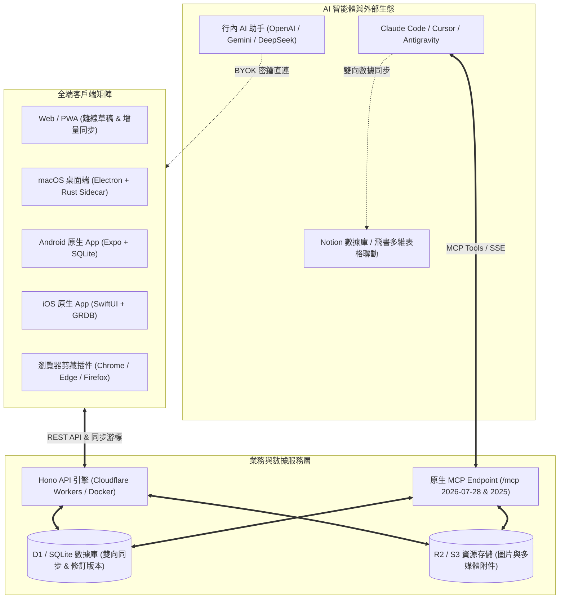
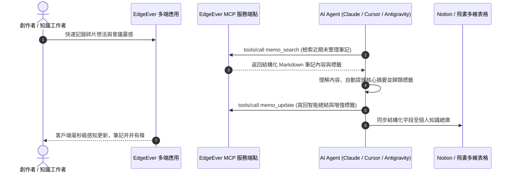

> **EdgeEver** 是一款兼具**經典三欄美學**與 **AI 原生動力**的開源 Serverless / 容器化個人知識庫。它既找回了極客們鍾愛的經典印象筆記式雙視圖與樹狀目錄，又以零服務器成本、完全數據自主、全端原生覆蓋與深度 MCP 智能體協同，重新定義了下一代個人第二大腦。

---

## ⚡ 1. 爲什麼選擇 EdgeEver？

*提示：在編輯器模式下，你可以直接點擊任意表格單元格進行行內編輯，或右鍵快捷插入/刪除行列。*

| 核心維度 | 傳統商業雲筆記 (如 Evernote) | 本地離線知識庫 (如 Obsidian) | EdgeEver 極客知識庫 |
| :--- | :--- | :--- | :--- |
| **雲端託管成本** | 商業訂閱高昂（$10+/月） | 官方雲同步收費（$5+/月） | **100% 永久免費 (Cloudflare 免費額度 / Docker 自建)** |
| **數據資產所有權** | 專有格式封閉，導出困難 | 本地 Markdown，移動端同步繁瑣 | **完全自主掌控 (D1 SQLite 數據庫 / R2 / 無損 ZIP 導出)** |
| **寫作與編輯體驗** | 僅富文本，排版易錯亂 | 純 Markdown，缺乏沉浸所見即所得 | **雙視圖自由切換 (所見即所得富文本 ⇄ Markdown 源碼)** |
| **自媒體排版分發** | 無樣式優化，格式丟失 | 需藉助外部排版擴展或工具 | **一鍵複製到微信公衆號 / Substack / Medium / WordPress** |
| **社交卡片分享** | 截圖粗糙或無排版設計 | 需第三方插件實現 | **內置 8 款精美海報主題，支持自定義字體與 PNG/JPEG 導出** |
| **AI 原生集成生態** | 封閉收費，僅限特定功能 | 需配置複雜的第三方插件 | **原生內置 MCP 服務端點 (`/mcp`) 與行內 AI 智能體協同** |
| **全平臺多端覆蓋** | 限制免費設備登錄數量 | 多端同步與移動端體驗門檻高 | **Web / PWA / Android / iOS / macOS / Windows (即將推出)** |

---

## 🏗️ 2. 全景架構與生態聯動

通過下面的 Mermaid 架構圖，你可以清晰瞭解 EdgeEver 如何將多端客戶端、零成本雲基礎設施與 AI Agent 緊密串聯：



---

## 🎨 3. 極致創作體驗與排版美學

EdgeEver 將高效與優雅融入每一處交互細節，助你專注于思考與表達：

### 🖥️ 雙視圖編輯器與沉浸模式
- **自由切換視圖**：點擊右上角 `</>` 按鈕或使用快捷鍵，可在**所見即所得富文本**與 **Markdown 源碼**間無縫切換，實時雙向保真。
- **左側可摺疊大綱**：自動解析文檔 `H1-H3` 標題層級，支持點擊平滑滾動跳轉，助你輕鬆把控萬字長文。
- **Zen 專注模式**：按下 `Cmd/Ctrl + Shift + F`，隱藏所有側邊欄與干擾元素，進入純粹寫作心流。
- **閱讀保護模式 (Reading Protection)**：日常翻閱或查閱筆記時，按下 `Cmd/Ctrl + E` 即可一鍵開啓只讀保護，鎖定當前編輯狀態，避免沉浸閱讀時誤觸鍵盤或意外改動筆記內容；再次按下即可隨手切回編輯。

### 🎭 精選排版主題與一鍵自媒體發佈
- **內置排版主題**：支持一鍵切換 `WeChat Classic Green (微信經典綠)`、`Modern Mint (薄荷青)`、`Minimal Emerald (極簡祖母綠)`、`Outline Emerald (大綱祖母綠)` 等風格。
- **一鍵排版複製**：專爲內容創作者設計。點擊頂部工具欄的**微信公衆號圖標**，系統自動將當前筆記轉爲內聯 CSS 樣式的優雅富文本，直接粘貼至微信公衆號後臺、Substack 或 WordPress，排版與代碼高亮完美保真。

### 🖼️ 8 套精美社交分享海報 (Poster Cards)
點擊右上角“分享爲卡片”，即可將任意筆記或片段渲染爲高清分享海報，支持：
- **8 大主題風格**：`Slate (巖灰)`、`Aurora (極光青)`、`Sunset (落日暖橙)`、`Midnight (暗夜極客)`、`Mint (清爽薄荷)`、`Notepad (復古便籤)`、`Xuan (宣紙水墨)`、`Lavender (薰衣草紫)`。
- **排版定製**：支持無襯線 (Sans)、宋體/明朝 (Serif)、等寬代碼 (Mono) 字體切換，自由選擇緊湊、標準或寬幅卡片，一鍵導出爲高清晰度 PNG 或 JPEG 圖片。

---

## ⌨️ 4. 效率工具箱：斜槓指令、雙鏈與數學公式

### 🪄 斜槓指令 (Slash Commands)
在正文空白行輸入 `/` 或直接按下 `空格鍵`，即可呼出快捷指令菜單：
- 快速插入 `H1/H2/H3` 標題、引用、分割線、代碼塊與富文本表格；
- 輸入 `/date`、`/time` 或 `/now` 快速插入當前標準時間戳；
- 插入附件、圖片或調起行內 AI 智能助手。

### 🔗 知識雙鏈與筆記引用
在編輯器中輸入 `@` 或插入 `#memo=<筆記ID>` 鏈接，即可建立筆記間的雙向關聯，點擊即可在工作區內快速打開關聯筆記，構建結構化網狀知識庫。

### 📐 KaTeX 專業數學公式渲染
EdgeEver 原生支持 LaTeX 數學表達式，無論是行內微積分還是多行物理方程，均可毫秒級高保真渲染：

- **行內公式**：例如質能方程 $E = mc^2$，以及正態分佈概率密度函數 $f(x) = \frac{1}{\sigma \sqrt{2\pi}} e^{-\frac{(x-\mu)^2}{2\sigma^2}}$。
- **多行獨立公式塊**：
$$
\oint_{\partial \Omega} \mathbf{E} \cdot d\mathbf{S} = \frac{1}{\varepsilon_0} \iiint_{\Omega} \rho \, dV, \quad \oint_{\partial \Omega} \mathbf{B} \cdot d\mathbf{S} = 0
$$

### ✅ 交互式待辦清單 (Task Lists)
- [x] 體驗 EdgeEver 雙視圖與大綱導航
- [x] 探索 8 款編輯器主題與 8 套社交海報卡片
- [ ] 嘗試使用斜槓指令 `/` 插入當前日期與結構化表格
- [ ] 配置個人 AI API Key，體驗行內智能總結與續寫
- [ ] 開啓 MCP 協議，讓 AI Agent 協助整理工作區

---

## 🤖 5. AI 原生協同與 MCP 智能體生態

EdgeEver 走在 AI 時代前沿，將大語言模型與智能體深度融入知識管理生命週期：



### 1️⃣ 行內 AI 助手 (Inline AI Assistant)
在正文空白行直接按下 **`空格鍵 (Space)`**、輸入 **`/ai`**、通過 **`/`** 斜槓指令菜單，或選中文本點擊浮動工具欄中的 **AI 按鈕**，即可即時呼出 AI 寫作助手面板：
- **精煉總結與要點提取**：一鍵壓縮提煉全文核心結論、提取待辦事項與關鍵行動項；
- **格式保真智能翻譯**：在嚴格保留原有 Markdown、數學公式、鏈接與代碼塊的前提下，精準翻譯多國語言；
- **內容重塑與風格改寫**：支持改進表達、修正錯別字與語法、轉爲社交媒體（如小紅書/推特）風格，或按上下文順滑續寫；
- **BYOK 隱私直連 (Bring Your Own Key)**：支持直連 OpenAI、Anthropic Claude、Google Gemini、DeepSeek 及各類 OpenAI 兼容的中繼 API，數據完全由端側直髮，不經過任何第三方中轉。

### 2️⃣ 開放 MCP 協議 (Model Context Protocol)
在**設置 → MCP 設置**中生成專屬令牌，即可將 EdgeEver 接入 Claude Code、Cursor、Antigravity、OpenClaw 等主流 AI 編碼助手與智能體平臺：
- **無縫讀寫**：支持標準 MCP 端點 `/mcp`（兼容最新的無狀態 `2026-07-28` 協議與經典握手協議）；
- **自動化流轉**：AI Agent 可自動讀取筆記、智能歸檔、批量打標，甚至與 Notion、飛書多維表格建立跨平臺自動化同步。

---

## 📱 6. 全平臺原生覆蓋、離線同步與智能剪藏

- **多端原生支持**：
  - **Web / PWA**：支持現代瀏覽器全功能運行與離線安裝；
  - **Android 原生客戶端**：基於 Expo 與 SQLite 構建，已上架 Google Play，並提供簽名 APK 下載；
  - **iOS 原生客戶端**：基於 Swift / SwiftUI 與 GRDB 原生實現，流暢細膩，已上架 App Store；
  - **macOS 桌面端**：Electron + Rust 高性能 Sidecar，支持 Apple Silicon 和 Intel Mac，內置靜默後臺更新；
  - **Windows 桌面端**：已開發完畢，即將正式推出。
- **瀏覽器網頁剪藏 (Web Clipper)**：已在 Chrome、Edge 和 Firefox 官方擴展商店發佈，一鍵剔除網頁廣告，將正文純淨沉澱爲 Markdown 筆記。
- **微信公衆號一鍵剪藏**：在移動端系統分享菜單中，直接將微信文章分享到 EdgeEver，客戶端將自動提取圖文排版並轉換爲可編輯筆記。
- **離線草稿與彈性同步**：地鐵、飛行模式等無網絡環境下自由編輯，重新聯網後自動入隊完成增量同步與衝突協調。

---

## 📦 7. 多媒體管理、無損備份與零成本自建

### 🖼️ 智能本地圖片壓縮
在筆記中粘貼或拖入高分辨率圖片時，前端會在本地自動將其轉碼壓縮爲 WebP 格式，在保證視覺無損的前提下**減少 50% - 90% 的體積**，大幅降低雲端存儲佔用並提升跨端加載速度。


### 📎 多類型附件自由掛載
支持在筆記中嵌入 PDF 文檔、CSV 表格、壓縮包及多媒體資源，點擊即可在線預覽或下載：
- [📄 產品白皮書 PDF：edgeever-product-brief.pdf](/api/v1/resources/res_demo_product_brief_pdf/blob)
- [📊 功能矩陣 CSV：feature-matrix.csv](/api/v1/resources/res_demo_feature_matrix_csv/blob)
- [📦 示例附件壓縮包：edgeever-attachment-demo.zip](/api/v1/resources/res_demo_attachment_bundle_zip/blob)

### 🚀 兩種自建部署方案：Serverless 與 Docker
1. **Cloudflare Serverless（推薦，永久 100% 免費）**：基於 Workers + D1 數據庫 + R2 對象存儲構建，完全處於 Cloudflare 免費額度內，無需採購服務器，免運維、免證書續期。
2. **Docker 一鍵自建（VPS / NAS / 家用服務器）**：
   ```sh
   # 國際 VPS / NAS 極速安裝（GHCR 鏡像）
   curl -fsSL https://edgeever.org/install.sh | bash

   # 大陸地區 VPS / NAS 鏡像加速（騰訊雲 TCR 鏡像）
   curl -fsSL https://edgeever-installer-1256854452.cos.ap-guangzhou.myqcloud.com/install.sh | bash -s -- --mirror tcr
   ```
   單命令自動配置 Docker Compose 環境，並內置每日定時自動更新。

### 💾 絕對的數據自由：無損 ZIP 導入與導出
在**個人中心 → 導入與導出**中，可隨時將完整筆記庫打包導出爲結構清晰的 ZIP 壓縮包。解壓後即爲包含標準 YAML Front Matter、相對路徑附件圖片與完整修訂版本的純 Markdown 文件樹，隨時可在 Obsidian、VS Code 等任意工具中無縫打開，永不擔心平臺綁定！

---

> 💡 **快速體驗小貼士**：
> 1. 點擊右上角 **`</>`** 體驗絲滑的雙視圖切換；
> 2. 按下 **`Cmd/Ctrl + E`** 試一試閱讀保護模式，鎖定只讀避免誤改內容；
> 3. 按下 **`Cmd/Ctrl + O`** 呼出快速切換器 (Quick Switcher)；
> 4. 點擊頂部 **微信圖標**，體驗一鍵帶格式排版複製；
> 5. 點擊 **“分享爲卡片”**，挑選一款你心儀的社交海報風格並導出；
> 6. 隨時在側邊欄或設置中點擊 **“恢復 Demo 數據”**，一鍵重置演示工作區。
